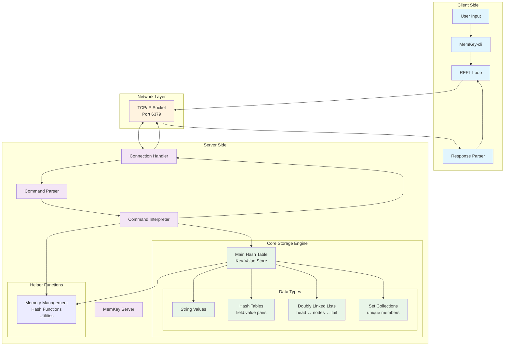
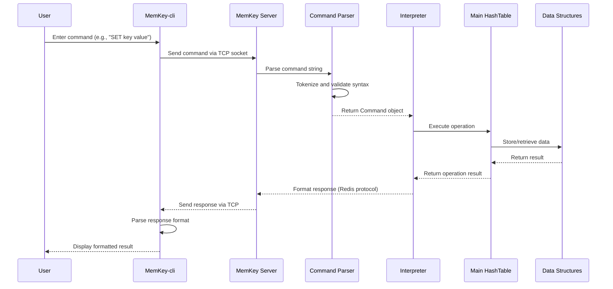
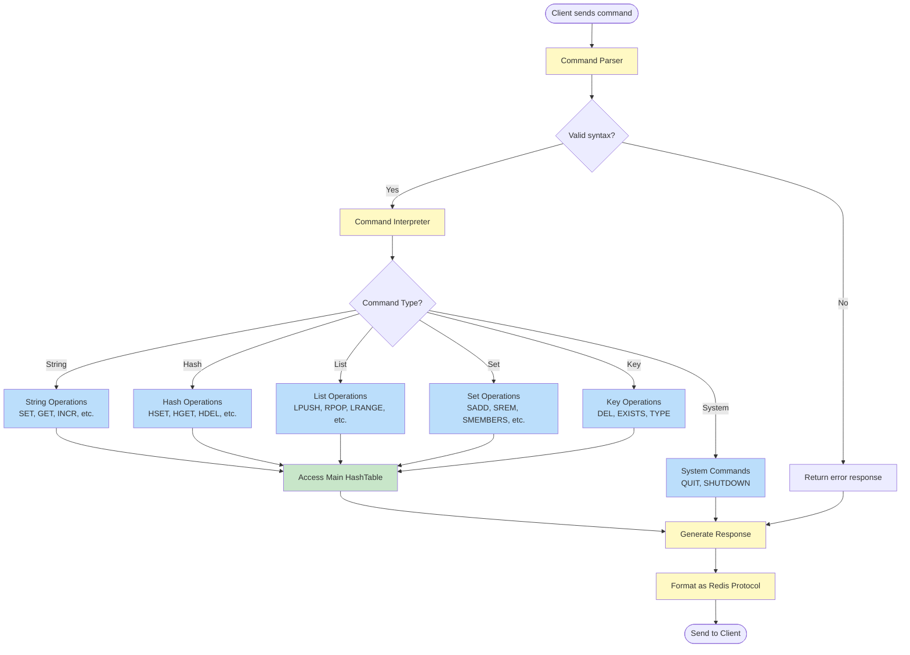
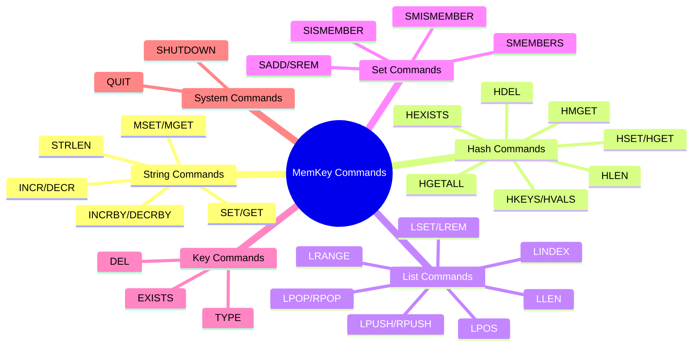
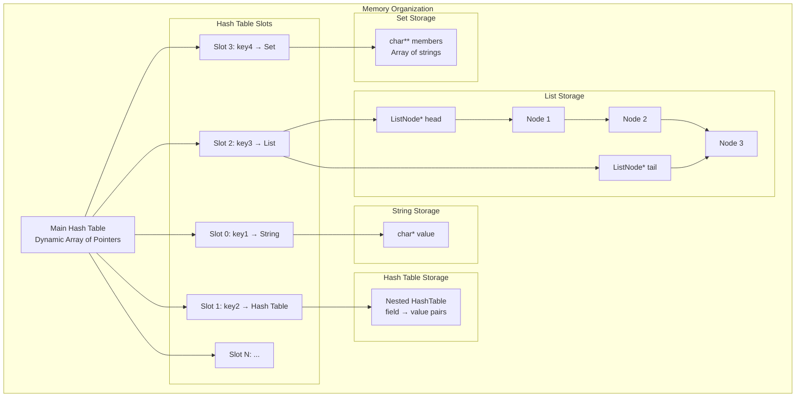

# MemKey Architecture Diagram

## System Overview
MemKey is a Redis-like in-memory key-value store with client-server architecture.



## Data Flow Architecture



## Core Data Structures

```mermaid
classDiagram
    class HashTable {
        +int size
        +int used
        +HashTableItem** items
        +htable_init()
        +htable_set()
        +htable_get()
        +htable_del()
    }
    
    class HashTableItem {
        +enum type
        +char* key
        +void* value
        +STR_T, HASH_T, LIST_T, SET_T
    }
    
    class List {
        +int len
        +ListNode* head
        +ListNode* tail
        +list_lpush()
        +list_rpush()
        +list_lpop()
        +list_rpop()
    }
    
    class ListNode {
        +char* value
        +ListNode* next
        +ListNode* prev
    }
    
    class Set {
        +int size
        +int used
        +char** members
        +set_add()
        +set_rem()
        +set_ismember()
    }
    
    class Command {
        +enum type
        +int argc
        +char** argv
        +SET, GET, HSET, LPUSH, etc.
    }
    
    HashTable ||--o{ HashTableItem : contains
    HashTableItem ||--|| List : "when type=LIST_T"
    HashTableItem ||--|| Set : "when type=SET_T"
    HashTableItem ||--|| HashTable : "when type=HASH_T"
    List ||--o{ ListNode : contains
```

## Command Processing Flow



## Supported Commands by Category



## Memory Layout


